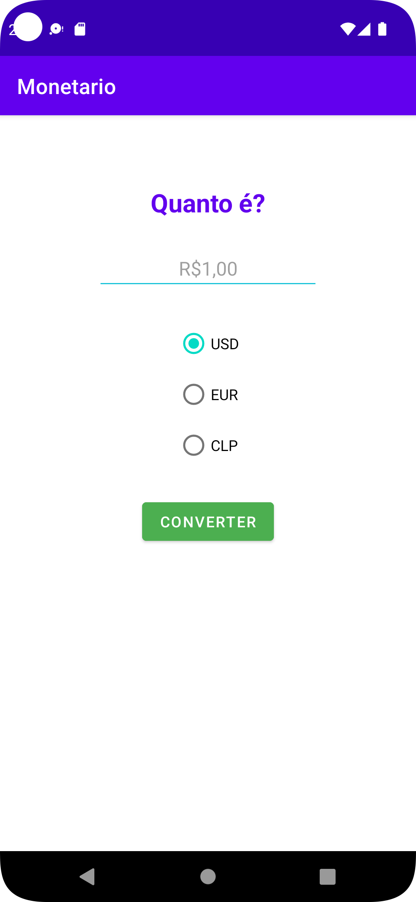
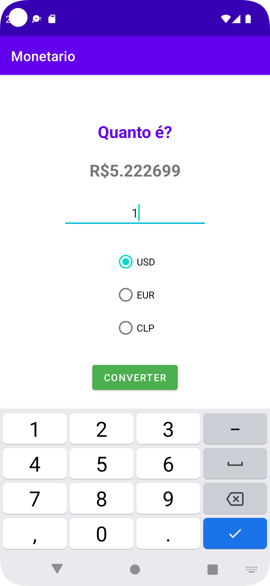

# Monetário

Aplicativo desenvolvido para Android em Kotlin para converter moedas.
Projeto no qual teve a instrução do professor Tiago Aguiar do canal [Tiago Aguiar](https://www.youtube.com/@TiagoAguiar).
## Demonstração

Insira um gif ou um link de alguma demonstração

## Funcionalidades

Converter valor em Reais para:
- Dólar
- Euro
- Peso Chileno

## Autores

- [@rafazolondek](https://www.github.com/rafazolondek)
- [Tiago Aguiar](https://www.youtube.com/@TiagoAguiar)

